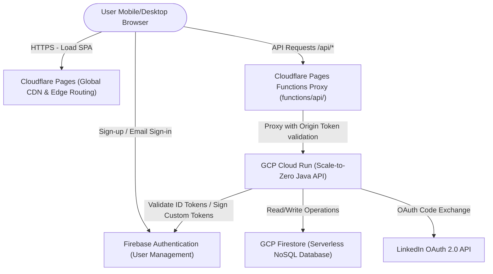
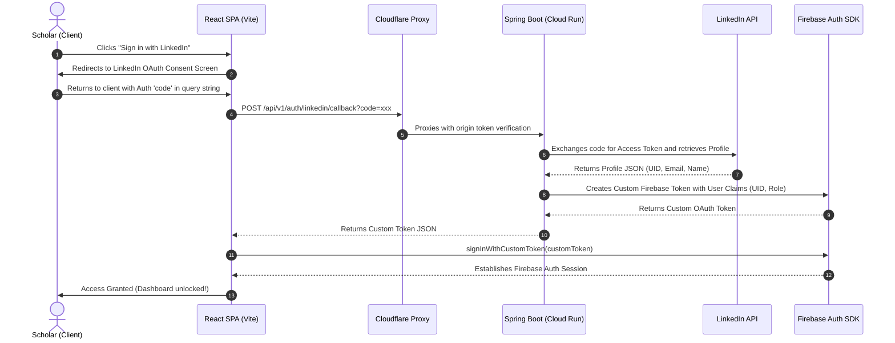
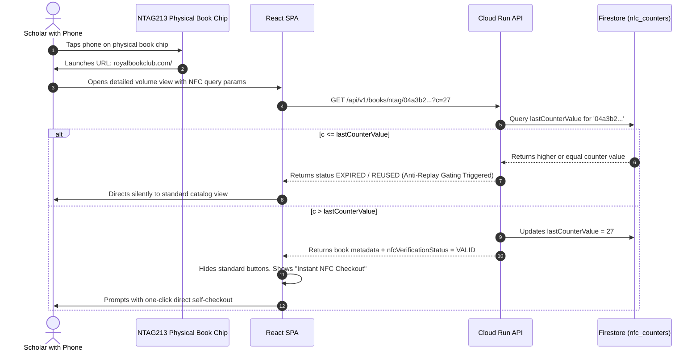

# Royal Book Club — System Design Document

This document provides a comprehensive reverse-engineered architectural blueprint of the **Royal Book Club** application ecosystem, covering both **High-Level Design (HLD)** and **Low-Level Design (LLD)**.

---

## 🏛️ High-Level Design (HLD)

The Royal Book Club operates on a modern, modern, serverless full-stack architecture designed for maximum performance, multi-region low latency, and an ultra-low-cost scale-to-zero operational footprint.

### Unified Component View



### Components Description

1. **Frontend Client (React 18 + Vite)**
   - Deployed as a single-page application (SPA).
   - Styled using custom CSS with a premium royal dark-mode theme, glassmorphic UI components, and micro-animations.
   - Integrates with the Firebase JS SDK for client-side Auth and Session management.
2. **Global CDN & Hosting Layer (Cloudflare Pages)**
   - Distributes the static frontend SPA globally with edge caching.
   - Provides DDoS protection, auto-compression (Brotli), and SSL termination.
3. **Edge Serverless Proxy (Cloudflare Pages Functions)**
   - Intercepts all requests destined for `/api/*` (defined in `functions/api/[[path]].js`).
   - Forwards request coordinates to the backend GCP Cloud Run service.
   - Attaches a secure origin header validation token (`CLOUDFLARE_SECRET`) to protect Cloud Run from direct, unauthorized bypass attempts.
4. **Backend REST API (Spring Boot 3.x / Java 21)**
   - High-performance, lightweight Spring Boot application optimized to start up instantly and process RESTful requests.
   - Scaled between `0` (idle) and `3` containers on GCP Cloud Run.
   - Uses Application Default Credentials (ADC) of its Cloud Run Service Account to seamlessly interact with Google Cloud Services.
5. **Serverless Identity Provider (Firebase Authentication)**
   - Manages user identity, password resets, and session validation.
   - Allows email/password logins and federated LinkedIn logins via backend custom tokens.
6. **NoSQL Database Layer (Google Cloud Firestore)**
   - Operates in Firestore Native Mode.
   - Stores schema-less document collections for books, checkouts, members, discourses, and system configurations.

---

## 🛠️ Low-Level Design (LLD)

This section details the internal architecture, package structure, database schemas, and critical logical flows.

### 1. Spring Boot Modular Backend Layout

The backend Java project is structured into modular feature packages:

```
com.royalbookclub.api/
├── RoyalBookClubApplication.java       # Spring Boot Application Entry Point
├── auth/                               # Security, OAuth, and Token Filtering
│   ├── controller/
│   │   └── LinkedInAuthController.java # OAuth Callback Handler
│   ├── filter/
│   │   ├── CloudflareSecretFilter.java # Inbound proxy header check
│   │   ├── FirebaseTokenFilter.java   # Firebase Authorization validator
│   │   └── UserAgentBlockFilter.java   # Anti-scraping agent blocker
│   └── service/
│       └── LinkedInAuthService.java    # Profiles fetch and custom token minting
├── book/                               # Book Catalog and Ingestion Core
│   ├── model/
│   │   ├── Book.java                   # Book catalog document mapping
│   │   ├── BookGenre.java              # Literary classification mapping
│   │   ├── BookReview.java             # Scholar critique rating mapping
│   │   └── NfcCounter.java             # Cryptographic NTAG counter tracking
│   ├── controller/
│   │   ├── BookController.java
│   │   └── NfcAdminController.java
│   └── service/
│       ├── BookService.java            # Tag verification and catalog rules
│       └── IsbnLookupService.java      # Fallback OpenLibrary ISBN scraper
├── checkout/                           # Circulation and Physical Verification
│   ├── model/
│   │   └── Checkout.java               # Active circulation log mapping
│   ├── controller/
│   │   └── CheckoutController.java     # Checkout endpoints
│   └── service/
│       └── CheckoutService.java        # Physical verification and geo-gating
└── user/                               # Users and Curators Gating
    ├── model/
    │   └── User.java                   # User profile document mapping
    ├── controller/
    │   └── UserController.java         # Profile and registration endpoints
    └── service/
        └── UserService.java            # Role hierarchy enforcement (ADMIN, MEMBER)
```

---

### 2. Firestore Document Database Schemas

Firestore is populated with six primary transactional and configuration collections.

#### 👥 Users (`users`)
```json
{
  "uid": "String (Firebase Auth UID)",
  "email": "String",
  "displayName": "String",
  "role": "String (MEMBER | ADMIN)",
  "phone": "String (Optional, Gated)",
  "houseNo": "String (Optional, Gated)",
  "street": "String (Optional, Gated)",
  "city": "String (Optional, Gated)",
  "pinCode": "String (Optional, Gated)",
  "consentAcceptedAt": "Timestamp (Optional)"
}
```

#### 📚 Books (`books`)
```json
{
  "isbn": "String (Primary Identifier)",
  "title": "String",
  "authors": "Array [String]",
  "description": "String",
  "coverUrl": "String (GCP Storage URL / Unsplash URL)",
  "ntagUid": "String (Physical NFC Tag UID, e.g., '04a3b2c1d0e980')",
  "genre": "String",
  "rating": "Double",
  "availability": "Boolean"
}
```

#### 🛒 Checkouts (`checkouts`)
```json
{
  "id": "String (Autogenerated UUID)",
  "bookId": "String (ISBN)",
  "memberId": "String (User UID)",
  "memberName": "String",
  "memberEmail": "String",
  "status": "String (REQUESTED_CHECKOUT | CHECKED_OUT | REQUESTED_RETURN | RETURNED)",
  "checkedOutAt": "Timestamp",
  "returnedAt": "Timestamp (Nullable)",
  "ntagUid": "String (NTAG UID registered during physical check)",
  "nfcOrBarcode": "String (NFC | BARCODE | MANUAL)",
  "returnLatitude": "Double (Nullable)",
  "returnLongitude": "Double (Nullable)",
  "locationVerified": "Boolean (Nullable)",
  "qrVerified": "Boolean (Nullable)"
}
```

#### 🔒 NFC Counter Security (`nfc_counters`)
Tracks anti-replay counters for rolling NTAG physical verification:
```json
{
  "ntagUid": "String (Primary Key)",
  "lastCounterValue": "Integer",
  "updatedAt": "Timestamp"
}
```

---

### 3. Authentication & Gating Flows

#### LinkedIn Federated Sign-in Flow



#### Physical NFC Tag Tap Verification & Self-Checkout



---

### 4. High-Level Cache & CDN Policies
- **Frontend SPA assets (JS, CSS, HTML)**: Cached at Cloudflare Edge network with aggressive TTL cache settings. Redeployments trigger an automatic Cloudflare Cache Purge.
- **Dynamic API requests `/api/*`**: Routed via Cloudflare edge bypass (no cache) to guarantee immediate read-after-write consistency in Firestore.
- **Images (Unsplash/GCP Storage buckets)**: Cached forever on clients and intermediate CDN edges via immutable HTTP cache headers.

---

### 5. Premium Epics System Architectures (Supplementary)

This section details the architectural designs, database schema updates, and state transitions for the outstanding Epics.

#### 📧 Epic 1: Email Verification Gating Architecture
- **Settings Schema (`checkout_settings` / `CheckoutSettings.java`)**:
  - Adds `private boolean enforceEmailVerification;` to control system-wide email verification requirements.
- **Backend Gating Logic (`CheckoutService.java` & `UserService.java`)**:
  - In `UserService.java`, the method `isEmailVerified(String uid)` queries standard password provider details:
    ```java
    var userRecord = firebaseAuth.getUser(uid);
    for (var provider : userRecord.getProviderData()) {
        if ("password".equals(provider.getProviderId())) {
            return userRecord.isEmailVerified();
        }
    }
    return true; // Auto-bypass federated OAuth providers (already verified)
    ```
  - In `CheckoutService.java`, `verifyUserProfileRequirements(String memberId)` intercepts standard and verified checkout pipelines:
    ```java
    if (settings.isEnforceEmailVerification()) {
        if (!userService.isEmailVerified(memberId)) {
            throw new BusinessRuleException("Sovereign verification gating: Your email address is unverified. Please check your inbox or profile page to verify.");
        }
    }
    ```
- **Client polling and Resend (`OnboardingWizard.jsx`)**:
  - If a logged-in password user's email is unverified and gating is active, they are presented with a gorgeous glassmorphic verification modal block.
  - Background polling occurs every 1 second via `auth.currentUser.reload()`, automatically unblocking the user when verification is detected.
  - Includes a "Resend Verification Email" button with a beautiful 60-second debounce mechanism.

#### 🎟️ Epic 2: Manual Checkout Gatepasses with Pending Status
- **UI State Transition (`GatepassPage.jsx`)**:
  - Instead of blocking the gatepass rendering when a request is `REQUESTED_CHECKOUT`, the barcode is shown normally.
  - A prominent yellow premium banner/watermark is overlaid to notify that the gatepass is **Pending Administrative Review**.
  - Once approved, the page automatically updates to "APPROVED LEAVE REALM" with full clearance.

#### 💬 Epic 3: Return Completion Modal Critique Prompt
- **Navigation Flow (`BookDetailPage.jsx`)**:
  - Upon successful return confirmation in the Web NFC/Barcode modal overlays, if the action was a return (`nfcActionType === 'return'`), the primary button transitions from "View Security Gatepass" (which is irrelevant for returns) to "Write a Book Review".
  - Clicking this button smoothly scrolls the viewport directly to the active reviews and rating form (`#reviews-section`), inviting the scholar to leave prompt feedback.

#### 📍 Epic 4: Geofencing Returns & Curator Boundary Console
- **Library Location Coordinates & Gating Preferences (`checkout_settings` / `CheckoutSettings.java`)**:
  - Adds `libraryLatitude` (Double), `libraryLongitude` (Double), and `validRadiusMeters` (Double).
  - Adds `enforceReturnGeofencing` (Boolean) and `enforceReturnQr` (Boolean) toggles to optionally skip or strictly enforce verification gates.
- **Curator Boundary Console (`CuratorSettingsPage.jsx`)**:
  - Integrates an interactive Leaflet map from CDN.
  - Admins can pinpoint the library location on the map, draw a radius circle dynamically, or click "Select Current Location" using the browser's Geolocation API.
  - Updates of the radius input box immediately redraw the circle boundary in real-time.
  - Provides toggles for `enforceReturnGeofencing` and `enforceReturnQr` configurations.
- **Backend Geofence Gating & Return Verification Fallback (`CheckoutService.java`)**:
  - If geofencing is enabled, direct verified returns (`verifiedReturn`) validate client coordinates against the library bounds. If check fails, or GPS coordinates cannot be resolved, client can transition to scan the physical **Return Validator QR** as fallback.
  - Manual returns request queue tracks coordinates (`locationVerified`) and scanned QR codes (`qrVerified`) so curators have instant visual validation aids.

#### 🔗 Epic 5: Pending Manual Return Bypass & Co-checkout Verification
- **Manual Return Bypass**:
  - Manual return requests (`createReturnRequest`) bypass the Geofence check but save `locationVerified = false` and transition the status to `"REQUESTED_RETURN"`.
- **Co-checkout Verification Flow**:
  - When *any* user executes a successful checkout (NFC Direct, Barcode scan, or Manual/Admin approval) on a book that has a pending manual return request (`"REQUESTED_RETURN"`), the system automatically validates and closes the previous return request.
  - In a single Firestore transaction:
    ```java
    long reconciledCount = reconcilePendingReturns(transaction, cleanIsbn); // Updates status to RETURNED
    long effectiveAvailableCopies = availableCopies + reconciledCount;
    transaction.update(bookRef, "availableCopies", effectiveAvailableCopies - 1);
    ```
  - This perfectly maintains mathematical inventory consistency.

#### 📚 Epic 6: Multi-Copy Catalog Ingestion with Blank NFC Fallbacks
- **Schema Updates (`books` / `Book.java`)**:
  - Adds `private List<String> ntagUids = new ArrayList<>();` to store distinct physical serial numbers.
  - Legacy `ntagUid` field is maintained as a copy-compatible alias pointing to the first element (`ntagUids.get(0)`).
- **Book Ingestion UI (`BookIngestionConsole.jsx`)**:
  - Supports adding and updating multiple NFC tag inputs corresponding to the `totalCopies` field.
  - Any copy missing a physical tag is allowed as a "Blank Placeholder", and can be scanned/updated later.
- **Multi-Ntag Resolution**:
  - During checkout or return, if the legacy `ntagUid` field doesn't match the scanned tag, the system queries the `ntagUids` array using Firestore's native array containment `whereArrayContainsAny("ntagUids", candidates)` to resolve the book copy instantly.

#### 🔍 Epic 7: Curator Inventory Audit & Missing Volumes Reconciliation
- **Database Schema (`inventory_audits`)**:
  - Tracks unique auditing rounds:
    ```json
    {
      "id": "String (Autogenerated UUID)",
      "status": "String (IN_PROGRESS | COMPLETED)",
      "createdAt": "Timestamp",
      "completedAt": "Timestamp",
      "createdBy": "String (Admin UID)",
      "countedCopies": [
        { "isbn": "String", "ntagUid": "String", "title": "String", "scannedAt": "Timestamp", "status": "VERIFIED | UNKNOWN" }
      ],
      "uncountedCopies": [
        { "isbn": "String", "ntagUid": "String", "title": "String" }
      ]
    }
    ```
- **Auditing Flow**:
  - **Start**: Reads all registered books and multiplies them into copy-level items in `uncountedCopies`.
  - **Scan**: Admins input an ISBN, barcode, or tap NFC. If matched in `uncounted`, it moves to `countedCopies` with state `VERIFIED`. If unmatched, it is registered in `countedCopies` with state `UNKNOWN_IN_CATALOG`.
  - **Complete**: Remaining uncounted items are automatically marked as `MISSING`. Preserves state history.

#### 📚 Epic 8: Decoupled Primary Keys & Editable ISBNs
- **Database Schema & Key Decoupling**:
  - Adds `id` (String) field to represent the immutable, unique document ID in Firestore.
  - For existing books, `id` maps to the legacy ISBN (their existing document ID), allowing `isbn` to be updated dynamically while maintaining intact foreign key reference integrity.
  - For newly ingested books, a unique UUID or auto-generated ID is assigned to the `id` field.
  - Queries for books by ISBN now query: `whereEqualTo("isbn", cleanIsbn)` instead of document path lookups.
  - Adds `alternativeIsbns` (List of Strings) field at the parent `Book` level to support mistakenly printed barcode scans on physical volumes without overwriting or replacing the single, true parent `isbn`.
- **Backend Model Updates (`Book.java` & `BookDto.java`)**:
  - Add `private String id;` to both classes.
  - Add `private List<String> alternativeIsbns = new ArrayList<>();` to both classes.
  - Update `BookService` and related controllers/services to support matching and retrieving by decoupled `id`, true `isbn`, or any `alternativeIsbns` dynamically.
- **Search Console & Catalog Tag/Alternative ISBN Searching**:
  - The admin database search panel and the main catalog study listing page support comprehensive, unified text search filtering over: Title, Authors, true `isbn`, all `tags`, and all `alternativeIsbns`.


#### 🎟️ Epic 9: Globally Unique Copy-Level QR Code Tracking & Gated Navigation
- **Copy-Level QR Tracking (`BookCopy.java`)**:
  - Adds `private Long qrId;` to represent an optional, globally unique 9-digit sticker code representing a physical copy of a book.
- **Flat Indexing Array (`Book.java`)**:
  - Adds `private List<Long> qrIds = new ArrayList<>();` to store a flat array of all QR IDs associated with the book's copies for instant indexing.
  - Instant query resolver: `firestore.collection("books").whereArrayContains("qrIds", scannedQrId)`.
- **Standard QR Code URL Schema**:
  - Supports standard scanning of URLs matching: `https://bookshelfnet.com/qr=<QRID>`.
- **Gated Navigation**:
  - Scanning a copy QR code programmatically navigates the user to the standard **Book Details page** (`/catalog/:isbn?qrId=<QRID>`) with the regular checkout/return flow (gated pipeline), instead of initiating an instant NFC-style checkout bypass.

#### 📷 Epic 10: Omni-Scanner & Viewfinder Precedence Controls
- **Unified Camera Scanning**:
  - The study listing catalog scanner and book details checkout scanner support both standard barcode formats and QR code formats (`SafeHtml5QrcodeSupportedFormats.QR_CODE`).
- **Viewfinder Precedence**:
  - If both barcode and QR code are present in the viewfinder, the parser prioritizes the copy-specific QR code, enabling direct copy identification.

#### 📋 Epic 11: Curator Inventory Audit Notes & Checklist Verification
- **Curator Audit Notes**:
  - Extends `inventory_audits` to support text comments/notes captured during a live shelf audit.
- **Copy Checklist Verification**:
  - Adds copy verification flags to ensure physical and digital catalogs remain perfectly aligned:
    - ISBN matched
    - Description correct
    - Genre correct
    - Tags correct
    - NFC present
- **Post-Audit Filtering**:
  - Curator review screens provide filters to isolate items matching or failing specific checklist flags (e.g., show only books with bad descriptions, mismatched ISBNs, or missing NFCs).

#### 🪟 Epic 12: Gatepass Warning Overlays & Android WebView Compatibility
- **Gatepass Pending Gating Override**:
  - If a checkout request status is `REQUESTED_CHECKOUT`, the book detail view is NOT blurred or masked. Instead, the details remain completely clear, overlaying a highly prominent, elegant glassmorphic "Pending Administrative Approval" warning banner at the top of the interface.
- **Geofencing Curator Coordinates Fill**:
  - Adds a "Select Current Location" button leveraging the browser's Geolocation API to auto-fill latitude and longitude fields.
  - Resolves Academic theme contrast issues (grey-on-dark-grey text, white-on-white text input settings).
  - Fixes blank location selection rendering on Android Webview devices by utilizing native, standards-compliant HTML select styling.
