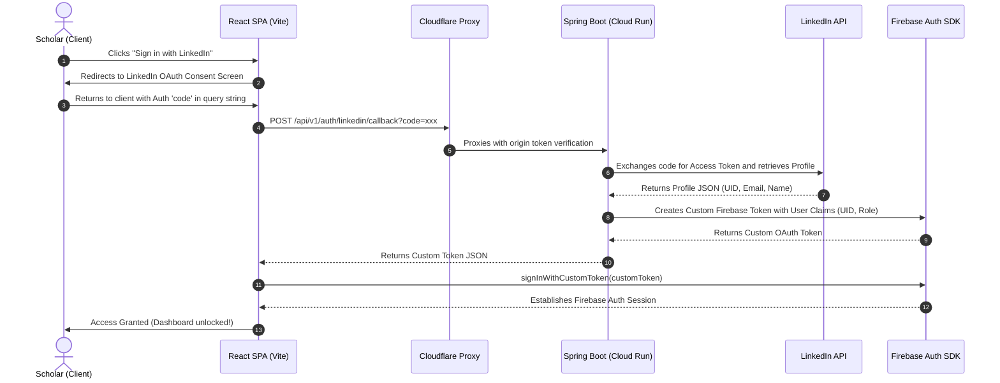
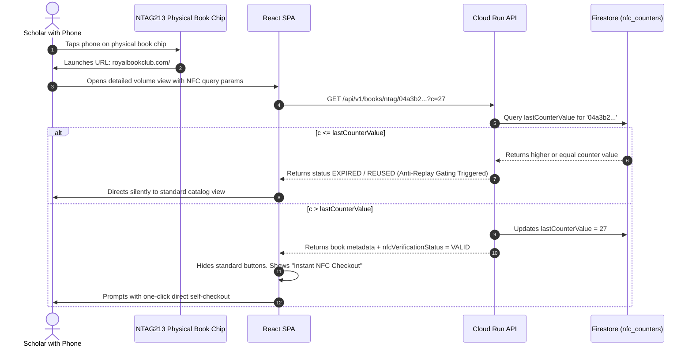

# Royal Book Club — System Design Document

This document provides a comprehensive reverse-engineered architectural blueprint of the **Royal Book Club** application ecosystem, covering both **High-Level Design (HLD)** and **Low-Level Design (LLD)**.

---

## 🏛️ High-Level Design (HLD)

The Royal Book Club operates on a modern, modern, serverless full-stack architecture designed for maximum performance, multi-region low latency, and an ultra-low-cost scale-to-zero operational footprint.

### Unified Component View


### Components Description

1. **Frontend Client (React 18 + Vite)**
   - Deployed as a single-page application (SPA).
   - Styled using custom CSS with a premium royal dark-mode theme, glassmorphic UI components, and micro-animations.
   - Integrates with the Firebase JS SDK for client-side Auth and Session management.
2. **Global CDN & Hosting Layer (Cloudflare Pages)**
   - Distributes the static frontend SPA globally with edge caching.
   - Provides DDoS protection, auto-compression (Brotli), and SSL termination.
3. **Edge Serverless Proxy (Cloudflare Pages Functions)**
   - Intercepts all requests destined for `/api/*` (defined in `functions/api/[[path]].js`).
   - Forwards request coordinates to the backend GCP Cloud Run service.
   - Attaches a secure origin header validation token (`CLOUDFLARE_SECRET`) to protect Cloud Run from direct, unauthorized bypass attempts.
4. **Backend REST API (Spring Boot 3.x / Java 21)**
   - High-performance, lightweight Spring Boot application optimized to start up instantly and process RESTful requests.
   - Scaled between `0` (idle) and `3` containers on GCP Cloud Run.
   - Uses Application Default Credentials (ADC) of its Cloud Run Service Account to seamlessly interact with Google Cloud Services.
5. **Serverless Identity Provider (Firebase Authentication)**
   - Manages user identity, password resets, and session validation.
   - Allows email/password logins and federated LinkedIn logins via backend custom tokens.
6. **NoSQL Database Layer (Google Cloud Firestore)**
   - Operates in Firestore Native Mode.
   - Stores schema-less document collections for books, checkouts, members, discourses, and system configurations.

---

## 🛠️ Low-Level Design (LLD)

This section details the internal architecture, package structure, database schemas, and critical logical flows.

### 1. Spring Boot Modular Backend Layout

The backend Java project is structured into modular feature packages:

```
com.royalbookclub.api/
├── RoyalBookClubApplication.java       # Spring Boot Application Entry Point
├── auth/                               # Security, OAuth, and Token Filtering
│   ├── controller/
│   │   └── LinkedInAuthController.java # OAuth Callback Handler
│   ├── filter/
│   │   ├── CloudflareSecretFilter.java # Inbound proxy header check
│   │   ├── FirebaseTokenFilter.java   # Firebase Authorization validator
│   │   └── UserAgentBlockFilter.java   # Anti-scraping agent blocker
│   └── service/
│       └── LinkedInAuthService.java    # Profiles fetch and custom token minting
├── book/                               # Book Catalog and Ingestion Core
│   ├── model/
│   │   ├── Book.java                   # Book catalog document mapping
│   │   ├── BookGenre.java              # Literary classification mapping
│   │   ├── BookReview.java             # Scholar critique rating mapping
│   │   └── NfcCounter.java             # Cryptographic NTAG counter tracking
│   ├── controller/
│   │   ├── BookController.java
│   │   └── NfcAdminController.java
│   └── service/
│       ├── BookService.java            # Tag verification and catalog rules
│       └── IsbnLookupService.java      # Fallback OpenLibrary ISBN scraper
├── checkout/                           # Circulation and Physical Verification
│   ├── model/
│   │   └── Checkout.java               # Active circulation log mapping
│   ├── controller/
│   │   └── CheckoutController.java     # Checkout endpoints
│   └── service/
│       └── CheckoutService.java        # Physical verification and geo-gating
└── user/                               # Users and Curators Gating
    ├── model/
    │   └── User.java                   # User profile document mapping
    ├── controller/
    │   └── UserController.java         # Profile and registration endpoints
    └── service/
        └── UserService.java            # Role hierarchy enforcement (ADMIN, MEMBER)
```

---

### 2. Firestore Document Database Schemas

Firestore is populated with six primary transactional and configuration collections.

#### 👥 Users (`users`)
```json
{
  "uid": "String (Firebase Auth UID)",
  "email": "String",
  "displayName": "String",
  "role": "String (MEMBER | ADMIN)",
  "phone": "String (Optional, Gated)",
  "houseNo": "String (Optional, Gated)",
  "street": "String (Optional, Gated)",
  "city": "String (Optional, Gated)",
  "pinCode": "String (Optional, Gated)",
  "consentAcceptedAt": "Timestamp (Optional)"
}
```

#### 📚 Books (`books`)
```json
{
  "isbn": "String (Primary Identifier)",
  "title": "String",
  "authors": "Array [String]",
  "description": "String",
  "coverUrl": "String (GCP Storage URL / Unsplash URL)",
  "ntagUid": "String (Physical NFC Tag UID, e.g., '04a3b2c1d0e980')",
  "genre": "String",
  "rating": "Double",
  "availability": "Boolean"
}
```

#### 🛒 Checkouts (`checkouts`)
```json
{
  "id": "String (Autogenerated UUID)",
  "bookId": "String (ISBN)",
  "memberId": "String (User UID)",
  "memberName": "String",
  "memberEmail": "String",
  "status": "String (REQUESTED_CHECKOUT | CHECKED_OUT | REQUESTED_RETURN | RETURNED)",
  "checkedOutAt": "Timestamp",
  "returnedAt": "Timestamp (Nullable)",
  "ntagUid": "String (NTAG UID registered during physical check)",
  "nfcOrBarcode": "String (NFC | BARCODE | MANUAL)",
  "returnLatitude": "Double (Nullable)",
  "returnLongitude": "Double (Nullable)"
}
```

#### 🔒 NFC Counter Security (`nfc_counters`)
Tracks anti-replay counters for rolling NTAG physical verification:
```json
{
  "ntagUid": "String (Primary Key)",
  "lastCounterValue": "Integer",
  "updatedAt": "Timestamp"
}
```

---

### 3. Authentication & Gating Flows

#### LinkedIn Federated Sign-in Flow



#### Physical NFC Tag Tap Verification & Self-Checkout



---

### 4. High-Level Cache & CDN Policies
- **Frontend SPA assets (JS, CSS, HTML)**: Cached at Cloudflare Edge network with aggressive TTL cache settings. Redeployments trigger an automatic Cloudflare Cache Purge.
- **Dynamic API requests `/api/*`**: Routed via Cloudflare edge bypass (no cache) to guarantee immediate read-after-write consistency in Firestore.
- **Images (Unsplash/GCP Storage buckets)**: Cached forever on clients and intermediate CDN edges via immutable HTTP cache headers.
